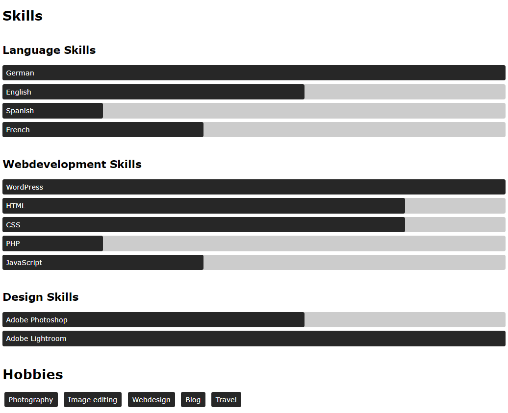

# Animated bar chart

## Demo

[https://animated-bar-chart.vercel.app/](https://animated-bar-chart.vercel.app/)

## Screenshot

## License

Licensed under the [MIT](https://github.com/peter-stuhlmann/animated-bar-chart/blob/master/LICENSE) license by [Peter R. Stuhlmann](https://peter-stuhlmann-webentwicklung.de).
